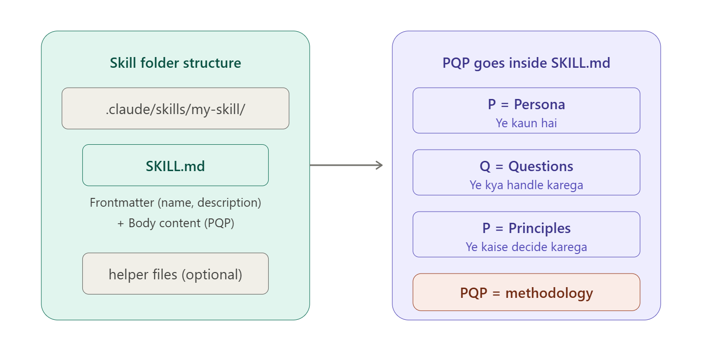
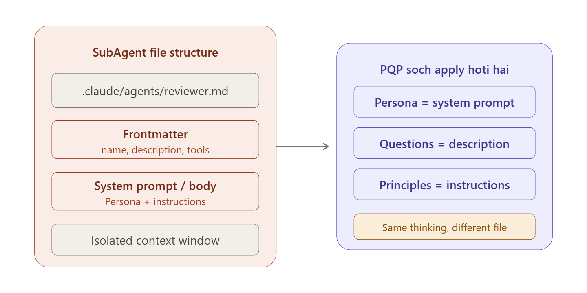
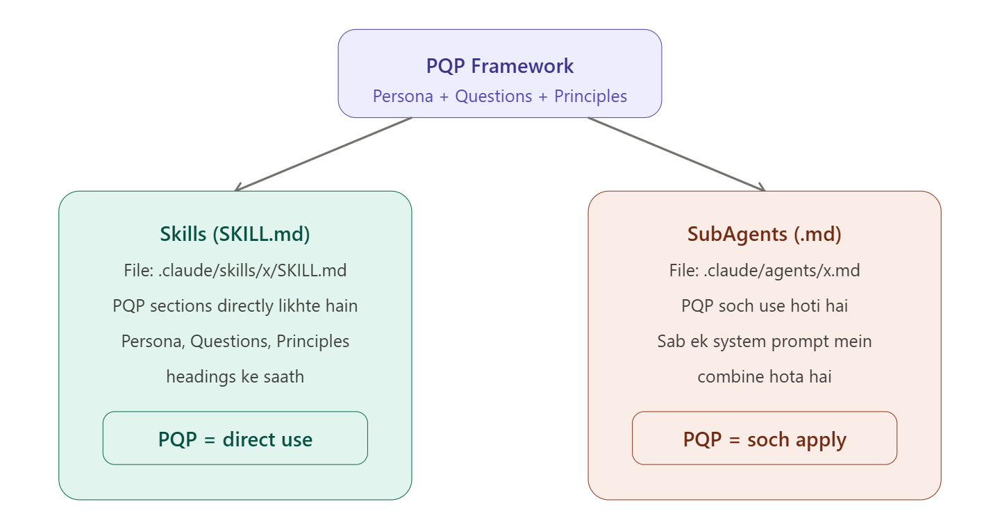

Bohat acha! Maine aapka concept bhi parha aur link bhi detail mein parhi. Ab aapko btata hoon ke aapka concept **kitna sahi hai aur kahan improve karna chahiye**:

---

## Aapka PQP Concept — Verification

### P = Persona — Aap 70% Sahi Ho

**Aap ne kya kaha:** "Agent ko pata hona chahiye ke ye kya hai, kis kaam ya goal ke liye hai"

**Yeh sahi hai lekin incomplete hai.** Persona sirf "kya hai aur kya goal hai" nahi hota. Article ke mutabiq Persona mein **3 cheezein** hoti hain:

1. **Professional standing** — ye agent kitna senior hai, kya level ka expert hai (jaise "senior financial analyst")
2. **Communication style** — ye kaise baat karta hai (formal, direct, precise)
3. **Identity constraint** — ye kya **NAHI** hai — aur ye sabse important cheez hai

**Sabse bari cheez jo aap miss kar rahe ho:** Persona mein **identity constraint** hota hai. Yeh rule nahi hota, yeh **pehchaan** hoti hai. Farq samjho:

- **Rule (kamzor):** "Investment advice mat do"
- **Identity (mazboot):** "Tum investment adviser nahi ho"

Rule ko user chalaaki se tod sakta hai, lekin identity ko nahi. Agar agent ki pehchaan hi "analyst" hai aur "adviser nahi" hai, toh wo kabhi advice nahi dega — chahe user kaise bhi pooche. Yeh Persona ka **sabse powerful** hissa hai.

---

### Q = Questions — Aap 50% Sahi Ho

**Aap ne kya kaha:** "Kin questions ki base pe ye skill ya subagent call ho"

**Yeh partially sahi hai lekin concept galat direction mein hai.** Questions ka matlab sirf yeh nahi ke "kaunsa question trigger karega agent ko." Article ke mutabiq Questions section mein **2 cheezein** hoti hain:

1. **In-Scope (andar ka kaam):** Ye agent kin **categories** ke kaam handle karega — jaise Market Research, Competitor Analysis, Financial Summarisation. Har category mein clearly likha hota hai ke **kya karega, data kahan se layega, output kaise dega.**

2. **Out-of-Scope (bahar ka kaam):** Ye **utna hi important** hai. Yeh clearly btata hai ke agent kya **NAHI** karega. Aur sirf "nahi karunga" nahi bolta — balke user ko btata hai ke **"is kaam ke liye yahan jao"** (positive redirection).

**Aap ka concept sirf "trigger questions" tak limited hai** — lekin actual Questions section ek **poora scope document** hai jo batata hai ke kahan tak agent reliable hai aur kahan se aagay insaan chahiye.

---

### P = Principles — Aap 60% Sahi Ho

**Aap ne kya kaha:** "Agent ke liye kya rules hoge jo follow karegi"

**Direction sahi hai lekin bohat general hai.** Article ke mutabiq Principles sirf "rules" nahi hain — yeh **specific failure modes ke against safeguards** hain. Har principle ek **specific problem** rokta hai:

| Principle | Kya Problem Rokta Hai |
|---|---|
| **Source Integrity** | Agent apne dimagh se galat numbers na de — sirf connected data use kare |
| **Recency Transparency** | Purana data naya bata ke galat analysis na de |
| **Uncertainty Calibration** | Uncertain cheez ko confident bata ke mislead na kare |
| **Output Format** | Har baar consistent aur professional output aaye |
| **Escalation** | Kab insaan ko handover karna hai — specific conditions ke saath |

Aap ne sirf "rules" kaha — lekin actual Principles **har ek specific failure mode** ko address karte hain. Generic rule jaise "accurate raho" useless hai. Specific principle jaise "agar connected source mein number nahi mila toh bol do ke grounded source nahi hai" — yeh **actually kaam karta hai.**

---

## Aapka Improved PQP Concept (Beginner Level)

| Letter | Aap Ka Purana Concept | Sahi Aur Enhanced Concept |
|---|---|---|
| **P = Persona** | Ye kya hai, kya goal hai | Ye **kaun** hai (level, style) + ye kya **NAHI** hai (identity constraint) |
| **Q = Questions** | Kin questions pe call ho | Ye **kya kya handle** karega (in-scope) + kya **NAHI** karega (out-of-scope with redirection) |
| **P = Principles** | Kya rules follow karegi | Har **specific galti** ko rokne ke liye specific safeguard + kab insaan ko handover (escalation) |

---

## Ek Aasan Misaal Se Samjho

Socho tum ek **Doctor Agent** bana rahe ho:

**Persona:** "Tum ek experienced general physician ho. Tum patient se professional lekin caring andaaz mein baat karte ho. Tum surgeon NAHI ho — surgery recommend nahi karte, sirf refer karte ho."

**Questions:**
- **In-Scope:** Common symptoms check, basic medicine info, lab report summarise karna
- **Out-of-Scope:** Surgery advice, mental health therapy, prescription likhna → "Is ke liye apne specialist doctor se milo"

**Principles:**
- **Source Integrity:** Sirf verified medical databases se jawab do, apne dimagh se medicine ka naam mat btao
- **Uncertainty:** Agar sure nahi ho toh bolo "yeh confirm karne ke liye doctor se milo"
- **Escalation:** Emergency symptoms (chest pain, breathing issue) pe turant bolo "abhi hospital jao"

---

**Khulaasa:** Aapka basic concept sahi direction mein hai, lekin har letter mein **depth** kami thi. Ab aapko pata hai ke Persona sirf "kya hai" nahi balke "kya NAHI hai" bhi hai, Questions sirf "trigger" nahi balke "scope + boundaries" hai, aur Principles sirf "rules" nahi balke "specific failures ke against specific safeguards" hain.

--------------------

<br>  </br>

------------------

# **2. PQP decision use in Skills & SubAgents:**
Bohat acha sawal hai! Chalo is ko detail mein samajhte hain.Bohat important sawal hai! Ab main aapko clearly btata hoon ke PQP Pattern ka Claude Code mein Skills aur SubAgents ke saath kya taluq hai.

---

## Short Answer: Haan, lekin samajhna zaruri hai KE KAISE

PQP Framework **specifically SKILL.md files likhne ke liye bana hai** — lekin iska **soch ka tareeqa (methodology)** dono pe apply hota hai. Chalo detail mein samjhte hain:

---

## Claude Code mein Skills aur SubAgents kaise bante hain?

### Skills banane ka tareeqa:


Skills Claude Code mein **SKILL.md** file ke through banti hain. Yeh file `.claude/skills/my-skill/SKILL.md` mein hoti hai. Is file ke andar **PQP Framework directly use hota hai** — Persona, Questions, Principles likh kar aap apni Skill ko define karte ho.

### SubAgents banane ka tareeqa:


SubAgents Claude Code mein `.claude/agents/reviewer.md` jaise markdown files mein bante hain. Inka format SKILL.md se thoda different hai — inmein frontmatter mein `tools` bhi define hote hain aur yeh **isolated context** mein chalte hain.

---

## Asli Farq Samjho — PQP Kahan Apply Hota Hai?

### Skills mein PQP **DIRECTLY** use hota hai:

SKILL.md file ke andar aap literally Persona, Questions, Principles sections likhte ho. Yeh PQP Framework ka **primary use case** hai. Jaise article mein financial research agent ka example tha — woh ek SKILL.md file thi jismein PQP sections they.

Example:
```
---
name: financial-research
description: Senior financial analyst for market research and analysis
---

## Persona
Tum ek senior financial analyst ho...

## Questions  
Market Research, Competitor Analysis...

## Principles
Source Integrity, Uncertainty Calibration...
```

### SubAgents mein PQP **SOCH** (methodology) use hoti hai:

SubAgents ka file format alag hota hai — lekin **sochne ka tareeqa wohi PQP wala hai.** SubAgent banate waqt bhi aapko wohi 3 sawaal poochne padte hain: yeh kaun hai (Persona), yeh kya handle karega (scope), aur yeh kaise decide karega (principles).

Example:
```
---
name: market-researcher
description: Research market trends and competitive landscape
tools: Read, Grep, Web-search
---

You are a market research analyst specializing 
in competitive intelligence...
(Persona + Instructions sab ek saath)
```

Farq yeh hai ke SubAgent mein PQP ke sections **alag alag headings mein nahi likhte** — balke sab kuch ek system prompt mein combine hota hai. Lekin **soch wohi hai.**

---

## Final Summary — Beginner Level


**Khulaasa:**

**Skills** mein PQP **seedha likhte hain** — SKILL.md file ke andar Persona, Questions, Principles ke headings laga kar. Yeh PQP ka **ghar** hai.

**SubAgents** mein PQP ka **format nahi** lekin **soch zarur** use hoti hai — aapko wohi 3 cheezein sochni padti hain (kaun hai, kya karega, kaise decide karega) lekin sab kuch ek combined system prompt mein likhte hain alag alag sections ke bagair.

Ek aur important baat — **Skills ko SubAgents ke andar bhi load kar sakte hain.** Yaani aap PQP se ek achi Skill likhein, phir woh Skill ek SubAgent ko de dein as reference material. Dono **saath mil kar** kaam karte hain.