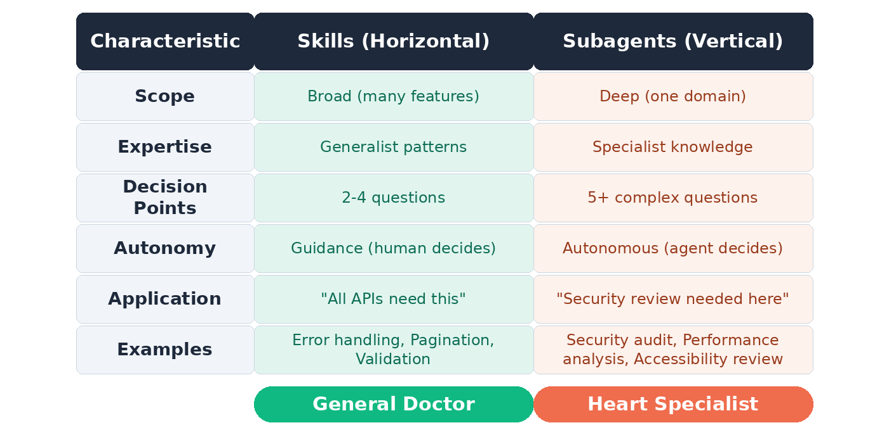

# Horizantal(Skills)  and Vertical(Sub-Agents)

Soch lo tum ek Doctor ho.

**Horizontal** growth ka matlab: Tum khud aur cheezein seekh lo — surgery bhi seekhi, cardiology bhi seekhi, neurology bhi seekhi. Tum hi ho, lekin tumhare paas zyada knowledge/tools hain.

**Vertical** growth ka matlab: Tum alag alag specialists hire kar lo — ek surgeon, ek cardiologist, ek neurologist. Tum coordinate karo, woh apna apna kaam karein.

-------------

#### IMPORTANT:
-  **Skills** = har jagah kaam aane wali basic helpers, 
- **SubAgents** = ek kaam ke liye expert autonomous workers.

